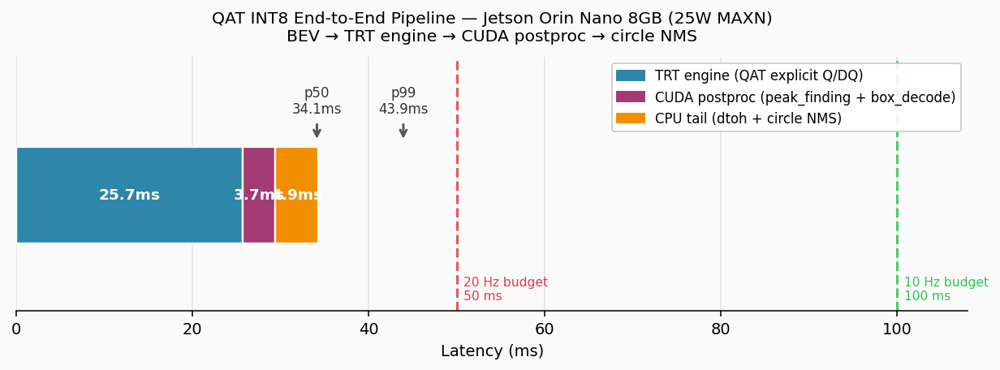

# EdgeFusion-CenterPoint

> Compression and edge deployment of CenterPoint LiDAR 3D detection for the Autoware autonomous-driving stack on Jetson Orin Nano.

[](https://github.com/gabrielmanalu/EdgeFusion-CenterPoint/actions)

---

INT8-compressed CenterPoint LiDAR 3D detector for real-time autonomous driving inference
on Jetson Orin Nano 8GB (25W power mode).

Covers the full pipeline from FP32 baseline evaluation through INT8 quantization,
structured pruning, knowledge distillation, TensorRT deployment, and Autoware integration.
Target: `autoware_perception_msgs::DetectedObjects` from a 25W edge device.

---

## Why this project

Modern production autonomous driving stacks run 3D LiDAR detection on data center GPUs.
Deploying the same quality perception on an embedded edge device requires careful compression
without destroying detection reliability.

This project answers: how much of a state-of-the-art LiDAR detector can be preserved
at INT8 precision and reduced channel count on Jetson Orin Nano, and what does the
accuracy / latency / power trade-off look like across the full Pareto front?

**Finding**: INT8 quantization of the full FP32 architecture is the correct compression
strategy for Jetson Orin Nano — accuracy is recovered to near-FP32 levels through
quantization-aware training (QAT), while structured pruning (L1-magnitude, 25–55%) does
*not* translate to proportional inference speedup on this hardware (tensor-core alignment
constraints + memory-bandwidth-bound execution), making its accuracy cost Pareto-dominated
by INT8 of the full architecture. A second, deployment-specific finding emerged on-device:
**how** INT8 is produced matters as much as the precision itself. Post-training calibration
of plain FP32 weights (TensorRT's entropy or minmax calibrators) leaves a real accuracy gap
versus FP32, while QAT-trained weights exported with explicit quantize/dequantize nodes
recover it — at the cost of a TensorRT layer-fusion penalty that makes the QAT engine
slower (25.7ms vs 8.1ms) and pushes power into the 25W envelope. The recommended deployable
configuration is therefore **QAT INT8 on the 25W power mode**, which comfortably meets
the 10–20Hz real-time LiDAR budget. See [`docs/design_decisions.md`](docs/design_decisions.md)
→ "On-device mAP validation" for the full investigation.

---

## Architecture

```
┌─────────────────────────────────────────────────────────────────────┐
│                    EdgeFusion-CenterPoint                           │
├─────────────────────────────────────────────────────────────────────┤
│  Input: PointCloud2 (nuScenes LIDAR_TOP, 32-beam)                   │
│                                                                     │
│  Voxelization → PointPillars encoder → Pillar scatter (512×512 BEV) │
│       ↓                                                             │
│  SECOND backbone  [3 blocks, stride 1/2/2]                          │
│  SECONDFPN neck   [upsample → 512×512 concat]                       │
│       ↓                                                             │
│  CenterPoint head [10 classes × 6 regression tasks]                 │
│  heatmap / reg / height / dim / rot / vel                           │
│       ↓                                                             │
│  Circle-NMS → DetectedObjects                                       │
├─────────────────────────────────────────────────────────────────────┤
│  Compression stack (cloud A40)                                      │
│  PTQ INT8 → Sensitivity → QAT → Pruning sweep → Distillation        │
├─────────────────────────────────────────────────────────────────────┤
│  Deployment (Jetson Orin Nano 8GB / 25W)                            │
│  QAT → ONNX (explicit Q/DQ) → TRT INT8 engine → ROS2 → Autoware     │
└─────────────────────────────────────────────────────────────────────┘
```

---

## Results

### Compression Sweep

| Variant | mAP | NDS | Params | Δ mAP |
| --- | --- | --- | --- | --- |
| FP32 baseline | 0.4815 | 0.5922 | 100% | — |
| PTQ INT8 | 0.4812 | 0.5903 | 100% | −0.03% |
| QAT INT8 | 0.4814 | 0.5910 | 100% | −0.01% |
| Pruned 25% | 0.4081 | 0.5382 | 56.4% | −15.2% |
| Pruned 40% | 0.2838 | 0.3902 | 36.0% | −41.0% |
| Pruned 55% | 0.2149 | 0.3136 | 20.3% | −55.4% |
| Distilled (25% arch) | 0.4094 | 0.5344 | 56.4% | −15.0% |

INT8 quantization is essentially free on this architecture (BatchNorm normalizes
activations before every conv, producing INT8-friendly distributions). One-shot
magnitude pruning shows a steep, accelerating accuracy cost past 25% — see
[`compression/README.md`](compression/README.md) for the full pruning sweep analysis,
per-class breakdown, and the EMA/BatchNorm buffer bug + recalibration recovery.

Knowledge distillation (same architecture/init/budget as Pruned 25%, with added teacher
guidance) produced essentially the same mAP (+0.32%, within noise) but worse NDS
(−0.71% — mAOE and mAVE both degraded). **Pruned 25% (task-loss-only) remains the
practical choice** for this ratio; see `compression/README.md` for the full root-cause
analysis (background-dominated heatmap distillation loss, teacher/student spatial
misalignment in regression distillation).

### Per-class AP (FP32 baseline)

| Class      | AP    | Class                | AP    |
| ---------- | ----- | -------------------- | ----- |
| Car        | 0.836 | Motorcycle           | 0.416 |
| Pedestrian | 0.761 | Barrier              | 0.596 |
| Bus        | 0.605 | Traffic cone         | 0.533 |
| Truck      | 0.483 | Bicycle              | 0.154 |
| Trailer    | 0.326 | Construction vehicle | 0.107 |

### Per-class AP — Pruning Sweep

| Class                | FP32  | Pruned 25% | Distilled 25% | Pruned 40% | Pruned 55% |
| -------------------- | ----- | ---------- | ------------- | ---------- | ---------- |
| car                  | 0.836 | 0.806      | 0.804         | 0.714      | 0.634      |
| pedestrian           | 0.761 | 0.717      | 0.712         | 0.601      | 0.507      |
| bus                  | 0.605 | 0.570      | 0.571         | 0.424      | 0.326      |
| barrier              | 0.596 | 0.533      | 0.534         | 0.319      | 0.221      |
| traffic_cone         | 0.533 | 0.429      | 0.427         | 0.252      | 0.167      |
| truck                | 0.483 | 0.415      | 0.425         | 0.248      | 0.137      |
| motorcycle           | 0.416 | 0.270      | 0.263         | 0.144      | 0.096      |
| trailer              | 0.326 | 0.249      | 0.265         | 0.109      | 0.054      |
| bicycle              | 0.154 | 0.034      | 0.035         | 0.003      | 0.000      |
| construction_vehicle | 0.107 | 0.059      | 0.059         | 0.024      | 0.006      |

Distillation's per-class deltas vs Pruned 25% are mostly noise-level (trailer +0.016,
truck +0.010, motorcycle −0.007). The two classes `L_heatmap_distill` specifically
targeted — bicycle and construction_vehicle — show **no change**.

### Jetson Deployment Results (Orin Nano 8GB, 25W, TRT 10.3.0)

All variants benchmarked on Jetson Orin Nano Super (JetPack R36.4.0, TRT 10.3.0)
with `jetson_clocks` locked, **25W** power mode. Power via tegrastats VDD_IN
(total module). On-device mAP/NDS measured on a **512-sample** subset of the
nuScenes val set (see "On-device accuracy" note below).

**Engine-only latency** (backbone+neck+head TRT engine, measured with CUDA events):

| Variant | Quant method | Engine | p50 | FPS | VDD_IN | mJ/frame | on-device mAP | on-device NDS | A40 mAP (ref) |
| --- | --- | --- | --- | --- | --- | --- | --- | --- | --- |
| **QAT INT8** (deployed) | QAT + explicit Q/DQ | 13.29 MB | 25.70ms | 38.9 | 19.87W | 257.8 | **0.4265** | **0.4804** | 0.4814 |
| FP32 → TRT INT8 | PTQ (minmax) | 6.82 MB | 8.09ms | 123.5 | 16.60W | 63.5 | 0.3612 | 0.4304 | 0.4815 |
| Pruned 25% → TRT INT8 | PTQ (minmax) | 4.90 MB | 7.46ms | 134.1 | 16.41W | 57.9 | 0.2637 | 0.3714 | 0.4081 |
| Pruned 40% → TRT INT8 | PTQ (minmax) | 4.35 MB | 8.17ms | 122.3 | 15.81W | 60.0 | 0.1176 | 0.1930 | 0.2838 |
| Pruned 55% → TRT INT8 | PTQ (minmax) | 3.44 MB | 6.93ms | 144.3 | 15.61W | 49.3 | 0.1556 | 0.2267 | 0.2149 |
| Distilled 25% → TRT INT8 | PTQ (minmax) | 4.92 MB | 7.46ms | 134.1 | 16.38W | 57.7 | 0.2599 | 0.3579 | 0.4094 |

**End-to-end pipeline** (BEV htod → engine → CUDA postproc → dtoh + NMS, QAT only):

| Stage | p50 | p99 | jitter (p99−p50) |
| --- | --- | --- | --- |
| TRT engine (engine-only benchmark) | 25.70ms | 28.08ms | 2.38ms |
| + BEV htod + CUDA postproc kernels | 29.37ms | 38.76ms | 9.39ms |
| + dtoh + circle NMS (CPU) | +4.88ms | +4.88ms | — |
| **Total pipeline** | **34.12ms** | **43.93ms** | **9.82ms** |

Power (total pipeline, 25W MAXN): **16.29W VDD_IN / 566.78 mJ/frame**



**Recommended deployment: QAT INT8, 25W mode.**
On-device mAP 0.4265 (near-FP32 ceiling of 0.432), total pipeline p50=34.12ms /
p99=43.93ms, 16.29W VDD_IN. Fits the 10–20Hz LiDAR real-time budget comfortably —
34ms uses 68% of the 20Hz (50ms) frame period even at median, and the p99 at 43.93ms
also clears it. This is the only configuration that recovers near-FP32 accuracy
on-device; see the sections below and
[`deployment/README.md`](deployment/README.md) for the full investigation.

#### Real-time target: latency vs LiDAR rate, not raw FPS

nuScenes LiDAR (Velodyne HDL-32E) runs at **20Hz**; most automotive LiDAR is
10–20Hz, and Autoware's standard perception target is **10Hz** (100ms/frame). The
deployment-relevant question is not "how many FPS" but "does inference complete
within one LiDAR frame period."

| Budget | Headroom (vs p50) | Headroom (vs p99) |
| --- | --- | --- |
| 10Hz (100ms) | 65.9ms (65%) | 56.1ms (56%) |
| 20Hz  (50ms) | 15.9ms (32%) | 6.1ms (12%) |

The FPS columns in the engine-only table are throughput metrics for
*comparing variants*, not deployment constraints. The e2e pipeline number (28.7 FPS
at the p50 total latency) is the accurate deployment throughput.

#### On-device accuracy: 512-sample subset vs A40 full-val (6019)

The `A40 mAP (ref)` column is the cloud PyTorch accuracy on the **full 6019-sample**
nuScenes val set (from the compression sweep). The on-device columns are measured
on a **512-sample** subset (the `jetson_calib` tokens, originally sized for INT8
calibration). The two are not directly comparable, for reasons isolated by a
controlled experiment (same 512 samples, same decode, only the execution backend
changed):

```
A40 PyTorch, full val (6019):                       mAP 0.4815
ONNX FP32, zero quantization, 512 subset:           mAP 0.432    ← ~10% rel drop
TRT INT8 (minmax, plain FP32 weights), 512 subset:  mAP 0.3612
TRT INT8 (QAT + explicit Q/DQ), 512 subset:         mAP 0.4265   ← recovers the gap
```

The 0.4815 → 0.432 step (~10% relative) is the *expected* cost of (a) evaluating on
512 rather than 6019 samples — nuScenes mAP averages 10 classes equally, and rare
classes (bus, construction_vehicle, motorcycle) have few instances in the subset,
making their per-class AP noisy — and (b) the project's standalone numpy decode being
a faithful but not byte-identical reimplementation of mmdet3d's tuned postprocessing.
This 0.432 is the realistic FP32 *ceiling* for the on-device pipeline; QAT INT8's
0.4265 sits essentially at that ceiling (−1.3% relative), confirming INT8 is near-free
**when deployed correctly**. Full methodology, including the multi-day BEV
calibration-data debugging saga that preceded these numbers, is in
[`docs/design_decisions.md`](docs/design_decisions.md).

#### Why QAT INT8 is slower than PTQ INT8 (and needs 25W)

The QAT engine is 3× slower than PTQ INT8 (25.70ms vs 8.09ms engine-only) despite
the same architecture. QAT (via `torch.ao.quantization`) exports ONNX with explicit
`QuantizeLinear`/`DequantizeLinear` (Q/DQ) nodes, which TensorRT runs through its
*explicit-quantization* path. That path honors the Q/DQ graph but **blocks the
Conv+BN+ReLU layer fusion** that PTQ INT8 relies on — each layer becomes a separate
kernel launch with dtype conversions, hence the latency (and the remaining 9.82ms
end-to-end jitter, which also originates in this TRT path). The accuracy benefit of
QAT is real; making it *also* fast would require NVIDIA's `pytorch-quantization`
toolkit (TRT-fusion-aware Q/DQ placement) instead of `torch.ao.quantization` —
documented as future work. The CUDA postprocessing stage (custom peak-finding and
box-decode kernels, Week 15-18) adds only ~3.7ms to the engine latency, and the
vectorized circle NMS adds ~4.9ms, for a total of 34.12ms end-to-end.

#### Why pruning does not help latency

Structured pruning does not translate to proportional inference speedup on Jetson
Orin Nano. Removing 43.6% of backbone+neck parameters (Pruned 25%) changes latency by
only ~0.6ms vs FP32 INT8, and Pruned 40% is actually *slower*, because:

1. **Tensor core alignment**: L1 magnitude pruning produces non-standard channel
   counts (75%, 60%, 45% of original power-of-2 layers). TRT pads these internally
   to the nearest multiple of 16 for tensor core dispatch, reducing the effective
   FLOP savings below what parameter counts suggest. Pruned 40% is empirically
   *slower* than the FP32 INT8 engine — a direct consequence of particularly
   unfavourable channel alignment at 60% of original.
2. **Memory bandwidth bound**: the 512×512 BEV spatial dimensions dominate memory
   access time and don't change with pruning. Channel reduction only partially
   offsets this.
3. **Fixed task head overhead**: all 6 task heads are unpruned — they contribute
   a constant latency floor regardless of backbone size.

The accuracy cost of pruning is an order of magnitude larger than any speedup,
making pruning Pareto-dominated by INT8 quantization of the full architecture. The
on-device pruned/distilled mAP numbers above are lower than their A40 references
largely *because they use PTQ on plain fine-tuned weights* (the same ~17% relative
gap measured for fp32 PTQ); none of the pruned/distilled variants were QAT-trained,
so their on-device numbers understate their true capability. The fair
variant-to-variant accuracy comparison is the A40 reference column.

In short: the A40 PTQ/QAT experiments established that this architecture *can* be
quantized near-free; the on-device work established that realizing that on TensorRT
requires QAT-trained weights with explicit quantization (PTQ calibration of plain
weights leaves a measurable gap, only partially closed by switching TRT's entropy
calibrator to minmax). See [`docs/design_decisions.md`](docs/design_decisions.md) →
"On-device mAP validation" for the full progression (entropy → minmax → QAT) and
the multi-day BEV calibration-data debugging saga that preceded it.

---

## Repository Structure

```
EdgeFusion-CenterPoint/
├── baseline/              ← FP32 evaluation + ONNX export
│   ├── eval.py
│   ├── export_onnx.py
│   └── README.md
├── compression/           ← PTQ, sensitivity, QAT, pruning, distillation, pareto
│   ├── ptq.py
│   ├── sensitivity.py
│   ├── qat.py
│   ├── pruning.py
│   ├── distillation.py
│   ├── pareto.py
│   ├── generate_calib_bev.py  ← multi-sweep BEV calibration tensor generator
│   ├── check_fakequant.py
│   ├── results/            ← checkpoints not in repo, see Checkpoints below
│   │   └── pareto/         ← charts + summary ARE in repo (embedded in README)
│   └── README.md
├── deployment/            ← TensorRT engine build, benchmark, on-device eval
│   ├── docker/
│   │   ├── Dockerfile        ← l4t-jetpack:r36.4.0, TRT 10.3.0
│   │   └── docker-compose.yml← build-engines / benchmark / infer / eval / dev
│   ├── plugins/
│   │   ├── center_head_postprocess.h    ← CUDA center-head postproc interface
│   │   ├── center_head_postprocess.cu   ← peak_finding + box_decode kernels
│   │   ├── CMakeLists.txt    ← builds libcenter_head_postprocess.so (sm_87)
│   │   ├── postprocess_wrapper.py       ← ctypes Python interface
│   │   └── test_parity.py    ← 15 parity tests (9 numpy + 6 CUDA)
│   ├── results/
│   │   └── pipeline_breakdown.png       ← e2e latency breakdown chart
│   ├── scripts/
│   │   ├── build_engine.py   ← ONNX → TRT (PTQ entropy/minmax, QAT Q/DQ, FP16)
│   │   ├── benchmark.py      ← engine-only CUDA event latency + tegrastats power
│   │   ├── benchmark_e2e.py  ← full pipeline latency (engine + postproc + NMS)
│   │   ├── eval.py           ← engine → numpy decode → submission JSON
│   │   ├── eval_cuda.py      ← engine → CUDA decode → submission JSON
│   │   ├── eval_metrics.py   ← submission JSON → mAP/NDS via nuscenes-devkit (host)
│   │   └── eval_all.sh       ← batch all variants
│   └── README.md             ← deployment journey, findings, and all commands
├── docs/
│   └── design_decisions.md
├── scripts/
│   └── setup_env.sh       ← new pod environment setup (~60-90 min)
└── .github/
    └── workflows/
        └── ci.yml
```

---

## Quick Start

### Environment setup (new pod)

```bash
git clone https://github.com/gabrielmanalu/EdgeFusion-CenterPoint.git \
    /workspace/mmdetection3d/EdgeFusion-CenterPoint
cd /workspace/mmdetection3d/EdgeFusion-CenterPoint
bash script/setup_env.sh 2>&1 | tee /workspace/setup_env.log
source /workspace/activate_env.sh
```

Setup installs PyTorch 2.1.0+cu118, mmcv 2.1.0, mmdet3d from the
autowarefoundation fork, and all dependencies (~60-90 min).

### Set variables

```bash
CFG=configs/centerpoint/centerpoint_pillar02_second_secfpn_head-circlenms_8xb4-cyclic-20e_nus-3d.py
CKPT=/workspace/data/centerpoint/centerpoint_02pillar_second_secfpn_circlenms_4x8_cyclic_20e_nus_20220811_031844-191a3822.pth
PTQ=EdgeFusion-CenterPoint/compression/results/ptq/ptq_calibrated.pth
QAT=EdgeFusion-CenterPoint/compression/results/qat/qat_best.pth
```

### 1. Evaluate FP32 baseline (~30 min)

```bash
python EdgeFusion-CenterPoint/baseline/eval.py \
    --config $CFG --checkpoint $CKPT
```

### 2. Export ONNX

```bash
python EdgeFusion-CenterPoint/baseline/export_onnx.py \
    --config $CFG --checkpoint $CKPT \
    --out-dir /workspace/data/centerpoint/onnx_multitask
```

### 3. PTQ calibration + INT8 eval (~35 min)

```bash
python EdgeFusion-CenterPoint/compression/ptq.py \
    --config $CFG --checkpoint $CKPT --calib-size 512
```

### 4. Sensitivity analysis (~65 min)

```bash
python EdgeFusion-CenterPoint/compression/sensitivity.py \
    --config $CFG --fp32-ckpt $CKPT --ptq-ckpt $PTQ
```

### 5. QAT fine-tuning (~12 hrs)

```bash
python EdgeFusion-CenterPoint/compression/qat.py \
    --config $CFG \
    --fp32-ckpt $CKPT \
    --ptq-ckpt $PTQ \
    --sensitivity EdgeFusion-CenterPoint/compression/results/sensitivity/sensitivity.json \
    --ptq-map 0.4812 --epochs 5 --batch-size 4
```

### 6. Structured pruning sweep (~8.5 hrs per ratio)

```bash
for RATIO in 0.25 0.40 0.55; do
    python EdgeFusion-CenterPoint/compression/pruning.py \
        --config $CFG --checkpoint $CKPT \
        --ratio $RATIO --epochs 5 \
        --batch-size 16 --lr 4e-4 --num-workers 16
done
```

### 7. Knowledge distillation (~8.5 hrs)

```bash
python EdgeFusion-CenterPoint/compression/distillation.py \
    --config $CFG --checkpoint $CKPT \
    --ratio 0.25 --epochs 5 \
    --batch-size 16 --lr 4e-4 --num-workers 16 \
    --alpha 1.0 --beta 1.0
```

---

## Checkpoints

Model weights are not stored in this repository.

**Download from Google Drive:** *(link to be added)*

| File | Description | Size |
| --- | --- | --- |
| `centerpoint_02pillar_...pth` | FP32 baseline (open-mmlab) | 24 MB |
| `ptq_calibrated.pth` | PTQ INT8 calibrated checkpoint | 24 MB |
| `qat_best.pth` | QAT INT8 fine-tuned checkpoint | 24 MB |
| `sensitivity.json` | Per-layer sensitivity results | 3 KB |
| `pruned_25_recalib.pth`, `pruned_model_25_recalib.pt` | Pruned 25% (recalibrated) | ~14 MB |
| `pruned_40.pth`, `pruned_model_40.pt` | Pruned 40% | ~9 MB |
| `pruned_55.pth`, `pruned_model_55.pt` | Pruned 55% | ~5 MB |
| `distilled_25.pth`, `distilled_model_25.pt` | Distilled (25% arch) | ~14 MB |
| `onnx_multitask/` | Exported ONNX files (encoder + backbone-neck-head) | 40 MB |
| `jetson_calib/` | 512 point clouds for TRT INT8 calibration on Jetson | ~200 MB |

The FP32 baseline checkpoint is also available from the
[open-mmlab model zoo](https://github.com/open-mmlab/mmdetection3d/tree/main/configs/centerpoint).

After downloading, place files at:

```bash
mkdir -p EdgeFusion-CenterPoint/compression/results/{ptq,qat,sensitivity,pruning/ratio_25,pruning/ratio_40,pruning/ratio_55,distillation/ratio_25}

cp ptq_calibrated.pth EdgeFusion-CenterPoint/compression/results/ptq/
cp qat_best.pth EdgeFusion-CenterPoint/compression/results/qat/
cp sensitivity.json EdgeFusion-CenterPoint/compression/results/sensitivity/
cp pruned_*25*.p* EdgeFusion-CenterPoint/compression/results/pruning/ratio_25/
cp pruned_*40*.p* EdgeFusion-CenterPoint/compression/results/pruning/ratio_40/
cp pruned_*55*.p* EdgeFusion-CenterPoint/compression/results/pruning/ratio_55/
cp distilled_*25*.p* EdgeFusion-CenterPoint/compression/results/distillation/ratio_25/
```

---


| Document                                               | Description                                                                      |
| ------------------------------------------------------ | -------------------------------------------------------------------------------- |
| [`baseline/README.md`](baseline/README.md)             | FP32 eval, ONNX export, Autoware param mapping                                   |
| [`compression/README.md`](compression/README.md)       | PTQ, sensitivity, QAT — implementation details, toolkit choice, design decisions |
| [`docs/design_decisions.md`](docs/design_decisions.md) | Architecture choices, checkpoint sourcing, quantization toolkit, ONNX export     |

---

## Key Design Decisions

**open-mmlab checkpoint over Autoware's**
Autoware does not release `.pth` weights — their model is trained on proprietary TIER IV
data. We use the open-mmlab nuScenes checkpoint and reproduce the published baseline
within ±0.6%, giving a fully reproducible starting point.

**Custom ONNX exporter**
Autoware's provided converter targets their 5-class model. Our 10-class multi-task head
cannot be exported with their script without modification. `export_onnx.py` directly
traces each head task and assembles the two-model structure Autoware expects.

**torch.ao over pytorch-quantization**
NVIDIA's `pytorch-quantization` has a C++ ABI mismatch against PyTorch 2.1.0+cu118 in
this environment, and source build fails due to CUDA 12.8 vs PyTorch's 11.8 requirement.
`torch.ao.quantization` is built into PyTorch and requires no separate compilation.

**Backbone and neck quantized, head kept FP32**
`pts_bbox_head` is ~4% of FLOPs. Its output layers (heatmap sigmoid, regression heads)
are sensitive to precision loss, and keeping them FP32 is standard practice in TRT AMP
for detection networks. Quantization effort concentrates on the SECOND backbone and
SECONDFPN neck where the gains are.

**PTQ = FP32 is correct, not a bug**
CenterPoint's BatchNorm architecture normalizes activations at every conv layer,
producing bounded symmetric distributions — exactly what INT8 quantization requires.
The result (−0.03% mAP) is genuine, not a measurement artifact.

**FP16 default in Autoware, INT8 here**
Autoware's production `autoware_lidar_centerpoint` defaults to `trt_precision: fp16`.
Our INT8 target is more aggressive and produces a 2× memory reduction and hardware
INT8 throughput gains on Jetson's 1024-core Ampere GPU.

**One-shot pruning over iterative pruning**
Channel pruning was applied in a single pass (L1-magnitude, deterministic given FP32
weights + ratio) followed by 5-epoch fine-tuning, rather than iterative prune-and-retrain
cycles. One-shot is simpler and ~3-5x cheaper, at the cost of a steeper accuracy falloff
past 25% (see pruning sweep results). Iterative pruning is the standard mitigation and
noted as future work if a sub-25% operating point is needed.

**Raw dataset for pruning/distillation fine-tuning, not CBGS**
CBGS class-balanced sampling inflates the dataset ~4.4x (1,759 → 7,724 steps/epoch),
making the 3-ratio pruning sweep cost ~112 hrs instead of ~25 hrs. Since fine-tuning
starts from FP32 weights that already encode CBGS-trained knowledge (validated by QAT:
raw dataset, 0.4814 mAP matching published numbers), the time savings were taken as a
documented trade-off — rare-class recovery is somewhat weaker without CBGS, visible in
the pruning sweep's bicycle/construction_vehicle results.

**Distillation as a controlled comparison, not a new architecture**
Rather than designing a novel "tiny" student, the distillation student uses the exact
same architecture/init/budget as Pruned 25% (same L1 channel selection from FP32). The
only difference is the loss function (task loss vs task + teacher distillation). This
isolates whether teacher guidance recovers pruning-induced capacity loss better than
fine-tuning alone — a directly comparable A/B result.

---

## Hardware

| Component              | Spec                                             |
| ---------------------- | ------------------------------------------------ |
| Training / compression | RunPod A40 (48GB VRAM, CUDA 12.8)                |
| Deployment target      | Jetson Orin Nano 8GB (1024-core Ampere, 67 TOPS) |
| TDP target             | 25W power mode (see deployment note)             |

---

## Dataset

nuScenes v1.0 — 700 training scenes, 150 validation scenes, 6019 val keyframes.

```
data/nuscenes/
├── samples/LIDAR_TOP/     ← point cloud sweeps (.pcd.bin)
├── sweeps/LIDAR_TOP/
├── maps/
└── v1.0-trainval/         ← annotations, calibration, scene metadata
```

pkl files (`nuscenes_infos_train.pkl`, `nuscenes_infos_val.pkl`,
`nuscenes_dbinfos_train.pkl`) are generated by mmdet3d's `create_data.py`
and must be placed at `data/nuscenes/` or the paths specified in the config.

---

## Acknowledgements

- [CenterPoint](https://github.com/tianweiy/CenterPoint) — Yin et al., 2021
- [autowarefoundation/mmdetection3d](https://github.com/autowarefoundation/mmdetection3d)
- [Autoware](https://github.com/autowarefoundation/autoware)
- [EdgeDrive-Perception](https://github.com/gabrielmanalu/EdgeDrive-Perception) — prior project; pillar CUDA kernels reused