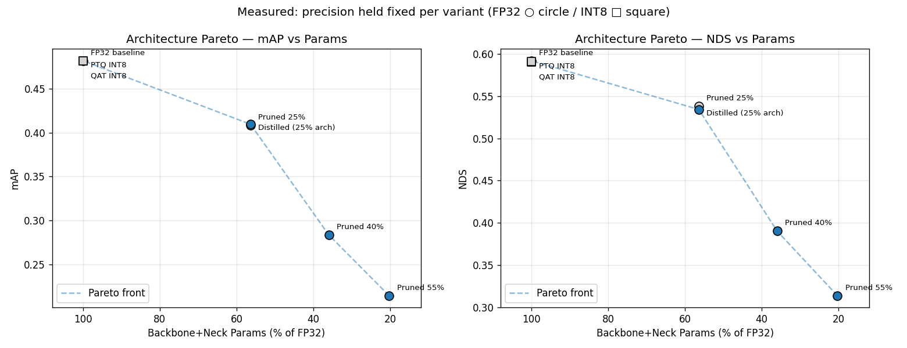
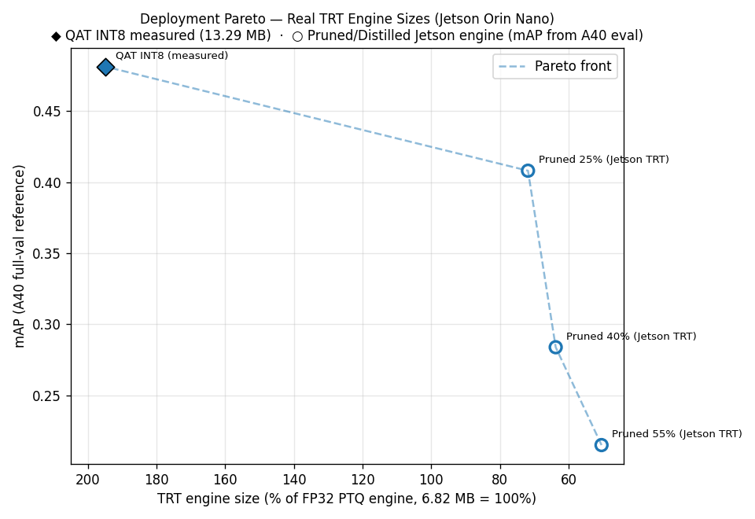

# Compression

This directory contains the full compression pipeline for CenterPoint:
Post-Training Quantization (PTQ) → Sensitivity Analysis → Quantization-Aware Training (QAT)
→ Structured Pruning Sweep → Knowledge Distillation → Pareto Assembly.

The goal is to map the accuracy / size / latency trade-off space for deploying CenterPoint
on Jetson Orin Nano (8GB, 15W), and identify which compressed variants are worth carrying
forward to TensorRT INT8 benchmarking on real hardware.

---

## Contents

```
compression/
├── ptq.py              # PTQ calibration + INT8 simulation eval
├── sensitivity.py      # Per-layer loss-proxy sensitivity analysis
├── qat.py              # QAT fine-tuning with mixed precision
├── pruning.py          # Structured channel pruning + BN recalibration
├── distillation.py     # Knowledge distillation (FP32 teacher -> pruned-arch student)
├── pareto.py           # Pareto front assembly
├── check_fakequant.py  # Diagnostic: verify FakeQuantize nodes are active
└── results/            # not in repo — see root README Checkpoints section
    ├── ptq/            # ptq_calibrated.pth, ptq_metrics.json
    ├── sensitivity/    # sensitivity.json
    ├── qat/            # qat_best.pth, qat_metrics.json
    ├── pruning/        # ratio_25/, ratio_40/, ratio_55/ — pruned_*.pth, pruned_model_*.pt
    └── distillation/   # ratio_25/ — distilled_*.pth, distilled_model_*.pt
```

---

## How to Run

All commands run from `/workspace/mmdetection3d`. Set environment variables first:

```bash
source /workspace/activate_env.sh

CFG=configs/centerpoint/centerpoint_pillar02_second_secfpn_head-circlenms_8xb4-cyclic-20e_nus-3d.py
CKPT=/workspace/data/centerpoint/centerpoint_02pillar_second_secfpn_circlenms_4x8_cyclic_20e_nus_20220811_031844-191a3822.pth
PTQ=EdgeFusion-CenterPoint/compression/results/ptq/ptq_calibrated.pth
```

### 1. PTQ (~35 min)

```bash
python EdgeFusion-CenterPoint/compression/ptq.py \
    --config $CFG \
    --checkpoint $CKPT \
    --calib-size 512
```

Outputs: `results/ptq/ptq_calibrated.pth`, `results/ptq/ptq_metrics.json`

### 2. Sensitivity (~65 min)

```bash
python EdgeFusion-CenterPoint/compression/sensitivity.py \
    --config $CFG \
    --fp32-ckpt $CKPT \
    --ptq-ckpt $PTQ
```

Outputs: `results/sensitivity/sensitivity.json`

### 3. QAT (~5-6 hrs, run in tmux)

```bash
python EdgeFusion-CenterPoint/compression/qat.py \
    --config $CFG \
    --fp32-ckpt $CKPT \
    --ptq-ckpt $PTQ \
    --sensitivity EdgeFusion-CenterPoint/compression/results/sensitivity/sensitivity.json \
    --ptq-map 0.4812 \
    --epochs 5 \
    --batch-size 4
```

Outputs: `results/qat/qat_best.pth`, `results/qat/qat_metrics.json`

### 4. Structured Pruning Sweep (~8.5 hrs per ratio, run in tmux)

```bash
for RATIO in 0.25 0.40 0.55; do
    python EdgeFusion-CenterPoint/compression/pruning.py \
        --config $CFG --checkpoint $CKPT \
        --ratio $RATIO --epochs 5 \
        --batch-size 16 --lr 4e-4 --num-workers 16
done
```

Outputs per ratio: `results/pruning/ratio_XX/pruned_XX.pth`,
`pruned_model_XX.pt`, `pruned_XX_metrics.json`, plus per-epoch checkpoints
(`pruned_XX_epochN.pth`) for early stopping.

If a checkpoint shows near-zero mAP (stale BatchNorm buffers — see
"EMA + BatchNorm Buffer Bug" below), recover without retraining:

```bash
python EdgeFusion-CenterPoint/compression/pruning.py \
    --config $CFG --checkpoint $CKPT --ratio 0.25 \
    --model-path results/pruning/ratio_25/pruned_25_epoch5.pth \
    --recalibrate --recalib-batches 200 \
    --batch-size 16 --num-workers 16
```

### 5. Knowledge Distillation (~8.5 hrs, run in tmux)

```bash
python EdgeFusion-CenterPoint/compression/distillation.py \
    --config $CFG --checkpoint $CKPT \
    --ratio 0.25 --epochs 5 \
    --batch-size 16 --lr 4e-4 --num-workers 16 \
    --alpha 1.0 --beta 1.0
```

Outputs: `results/distillation/ratio_25/distilled_25.pth`, `distilled_model_25.pt`,
`distilled_25_metrics.json`.

### Diagnostic (if FakeQuantize nodes appear missing)

```bash
python EdgeFusion-CenterPoint/compression/check_fakequant.py \
    --config $CFG --checkpoint $CKPT
```

---

## Results Summary

| Variant              | mAP       | NDS       | Params | vs FP32         |
| -------------------- | --------- | --------- | ------ | --------------- |
| FP32 baseline        | 48.15     | 59.22     | 100%   | —               |
| PTQ INT8             | 48.12     | 59.03     | 100%   | −0.03% / −0.19% |
| QAT INT8             | **48.14** | **59.10** | 100%   | −0.01% / −0.12% |
| Pruned 25%           | 40.81     | 53.82     | 56.4%  | −15.2% / −9.1%  |
| Pruned 40%           | 28.38     | 39.02     | 36.0%  | −41.0% / −34.1% |
| Pruned 55%           | 21.49     | 31.36     | 20.3%  | −55.4% / −47.0% |
| Distilled (25% arch) | 40.94     | 53.44     | 56.4%  | −15.0% / −9.8%  |

QAT recovered +0.0002 mAP and +0.0007 NDS over PTQ — small refinements as expected
when the architecture is already INT8-robust. The one marginally-sensitive layer
(`blocks.0.3` weight) was kept in FP16 via mixed precision.

The pruning sweep shows a steep, accelerating accuracy cost: 25% pruning (56.4% of
backbone+neck params) loses 15.2% relative mAP, but 40% pruning (36.0% params) loses
41.0% — more than 2.5x the relative cost for ~20pp fewer params. By 55% (20.3% params),
several rare classes (bicycle, construction_vehicle) collapse to near-zero AP and
velocity estimation degrades severely (mAVE 1.05 vs 0.35 baseline). One-shot magnitude
pruning hits a capacity ceiling quickly past 25% — see "Pruning Sweep" below.

Distillation (same architecture/init/budget as Pruned 25%, with added teacher guidance)
produced mAP 40.94 vs Pruned 25%'s 40.81 (+0.32%, within noise) but NDS 53.44 vs 53.82
(−0.71%, worse) — see "Knowledge Distillation" below for the full breakdown and root-cause
analysis. **Pruned 25% (task-loss-only) remains the practical choice** for this
compression ratio; distillation as implemented does not change the Pareto front.

---

## Toolkit Choice: `torch.ao` over `pytorch-quantization`

We use `torch.ao.quantization` (built into PyTorch 2.1) rather than NVIDIA's
`pytorch-quantization` library.

The reason is a CUDA version mismatch in our training environment: the system CUDA is 12.8
but our PyTorch is compiled against CUDA 11.8. The pre-built `pytorch-quantization` wheel
has a C++ ABI mismatch against PyTorch 2.1, and building from source fails because source
build requires the nvcc version that matches the PyTorch CUDA target (11.8), not the system
CUDA (12.8).

`torch.ao` is built directly into PyTorch and has no separate compilation step, making it
the only viable option in this environment.

---

## FakeQuantize vs Observers: A Critical Distinction

`torch.ao.quantization` has two preparation modes that look similar but behave very differently:

**`prepare_fx` (PTQ calibration mode)**

Inserts `ObserverBase` nodes (`HistogramObserver`, `MinMaxObserver`) that passively collect
activation statistics during forward passes. These observers do **not** modify the forward
pass — the model runs in full FP32 even with observers attached. The purpose is to collect
min/max statistics to compute optimal INT8 scales.

**`prepare_qat_fx` (QAT / INT8 simulation mode)**

Inserts `FakeQuantize` nodes that actively quantize and dequantize activations during the
forward pass: `x_fq = dequantize(quantize(x, scale, zp))`. The value is still stored as
FP32 but has been rounded to INT8 precision. This is called "fake" quantization because no
actual INT8 arithmetic occurs, but the precision loss is simulated faithfully.

### Why this matters

For accuracy measurement on GPU, only `prepare_qat_fx` gives valid results. `prepare_fx`
observers are invisible to inference — running eval on a `prepare_fx` model measures FP32
accuracy, not INT8 accuracy. All three scripts (ptq, sensitivity, qat) use `prepare_qat_fx`
for this reason.

### Why not true INT8 on GPU?

PyTorch's `convert_fx` (which produces actual INT8 arithmetic) targets CPU backends
(FBGEMM, QNNPACK) only. There is no CUDA INT8 inference path in vanilla PyTorch. On our
A40 GPU, true INT8 requires TensorRT, which is deferred to Jetson deployment. Here,
`FakeQuantize` gives the same accuracy information — the simulated INT8 precision loss is
identical to what TRT INT8 will produce — without the full TRT pipeline.

### The QConfig must use FakeQuantize explicitly

```python
# WRONG — produces observer nodes, forward pass is still FP32
qconfig = QConfig(
    activation=HistogramObserver.with_args(...),
    weight=PerChannelMinMaxObserver.with_args(...),
)

# CORRECT — produces FakeQuantize nodes, forward pass simulates INT8
qconfig = QConfig(
    activation=FakeQuantize.with_args(observer=HistogramObserver, ...),
    weight=FakeQuantize.with_args(observer=PerChannelMinMaxObserver, ...),
)
```

`prepare_qat_fx` does not automatically wrap raw observers in FakeQuantize. The QConfig must
explicitly specify FakeQuantize as the outer class, with the observer class passed as an
argument. Using raw observers with `prepare_qat_fx` silently produces observer nodes and the
node count check (`isinstance(m, FakeQuantizeBase)`) returns zero.

---

## PTQ Implementation

### Quantized modules

Only `pts_backbone` (SECOND) and `pts_neck` (SECONDFPN) are quantized. The detection head
(`pts_bbox_head`) is kept in FP32 for two reasons:

The head accounts for approximately 4% of total FLOPs, so the latency benefit of quantizing
it is minimal. More importantly, the head's output layers (heatmap sigmoid, regression
outputs) are accuracy-sensitive. Small quantization errors in these outputs translate
directly to missed detections or degraded localization. TensorRT's AMP mode follows the same
convention when building INT8 engines for detection networks.

### FX tracing fix for SECONDFPN

`prepare_qat_fx` uses PyTorch's FX tracer to symbolically trace the model graph. SECONDFPN's
`forward` method iterates over the input tuple using `len(x)`, which FX cannot evaluate
symbolically (it sees a dynamic value, not a constant). This causes tracing to fail.

The fix: temporarily patch `SECONDFPN.forward` before tracing to use
`len(self.deblocks)` (a constant known at trace time) instead of `len(x)`. The patch is
applied only during `prepare_qat_fx` and reverted immediately after, leaving the module
unmodified for all other operations.

### Calibration protocol

Calibration collects activation statistics over 512 training samples:

```
_set_calibration_mode(model, calibrating=True)
  → disable_fake_quant(), enable_observer() on all FakeQuantize nodes
  → run 512 training samples
_set_calibration_mode(model, calibrating=False)
  → disable_observer(), enable_fake_quant()
  → scales are now fixed from collected statistics
```

This two-phase protocol ensures the calibration statistics are collected before INT8
simulation begins. Running with fake-quant active during calibration would cause the observer
to collect statistics on already-quantized values, producing a feedback loop that degrades
scale accuracy.

### Why PTQ = FP32 on this architecture

CenterPoint uses Batch Normalization throughout the SECOND backbone and SECONDFPN neck. BN
normalizes activations to zero mean and unit variance before applying learned scale and bias
parameters. This means activation distributions entering each conv layer are already bounded
and symmetric — exactly the property that INT8 quantization requires. With 512 calibration
samples, `HistogramObserver` finds near-perfect INT8 scales for every layer.

The result is that PTQ on CenterPoint produces essentially zero accuracy degradation
(−0.03% mAP). This is not a measurement error — the architecture is genuinely INT8-robust by
design. Any network with BN after every conv will show similar behavior.

---

## Sensitivity Analysis

### Methodology

Sensitivity analysis identifies which quantized layers have the most impact on model
accuracy. For each FakeQuantize node, we measure how much the model's training loss increases
when that node alone is disabled (reverting that layer to FP32), while all other nodes remain
in INT8 simulation.

Using training loss as the proxy metric rather than full NuScenes mAP offers a significant
speed advantage: 500 training samples take approximately 7 minutes, versus approximately
20 hours for a full 6019-sample mAP evaluation per node (40 nodes × 30 min each). Loss
increase correlates reliably with detection degradation — a layer causing high mAP drop will
cause high loss increase under the same inputs.

### Results

```
18 FakeQuantize nodes analyzed
FP32 reference loss: 6.0292

Sensitive nodes (relative loss increase > 0.02):
  pts_backbone.blocks.0.3.weight_fake_quant    +0.028

Non-sensitive nodes: 17/18
```

Only one node marginally exceeds the 0.02 threshold: the weight quantizer for layer 3 of
the first backbone block. This is consistent with the general finding in quantization
literature that early feature extraction layers — those processing the raw input
representation — are more sensitive to precision loss, as errors here propagate through all
downstream layers. The sensitivity value (+0.028) is itself small, barely above threshold.

### Implications for mixed precision

QAT applies the sensitivity result by keeping `blocks.0.3.weight_fake_quant` in FP32 while
training all other 17 nodes in INT8. Given that even the sensitive node barely exceeds the
threshold, the expected accuracy difference between pure INT8 QAT and mixed-precision QAT is
negligible on this architecture. The mixed precision pass is included for methodological
completeness and to demonstrate awareness of quantization sensitivity in the portfolio.

---

## QAT Implementation

### Role of QAT given PTQ = FP32

When PTQ already achieves FP32 accuracy, QAT has no accuracy gap to recover. Its role here
is twofold:

First, QAT fine-tunes the model weights to be more robust to quantization constraints,
producing a checkpoint that will behave more reliably when converted to TRT INT8 on Jetson.
Weights that have been trained with INT8 simulation active adapt their value distributions
to be more quantization-friendly than weights that have only been calibrated post-hoc.

Second, QAT is the correct foundation for the pruning phase that follows. After structured
pruning removes channels from the backbone, accuracy will drop. QAT post-pruning will be the
primary tool for recovering that accuracy. Demonstrating QAT on the baseline model here
validates the methodology before the more demanding pruning experiments.

### Training protocol

QAT fine-tunes from `ptq_calibrated.pth` with:

- Optimizer: AdamW
- Learning rate: 1e-5 (low, to avoid disturbing well-trained FP32 weights)
- Epochs: 5
- Batch size: 4
- LR schedule: cosine annealing
- FakeQuantize: active throughout training (no warm-up period)

The low learning rate is appropriate here because the FP32 weights are already well-trained.
QAT at this stage is not recovering from a large accuracy drop — it is making small
adjustments to improve INT8 compatibility at the margin.

### Model initialization

Both sensitivity and QAT initialize via `init_model(cfg, fp32_ckpt)` rather than
`init_model(cfg, checkpoint=None)`. Initializing with the FP32 checkpoint is required
because the inference config (`centerpoint_pillar02_second_secfpn_head-circlenms_...py`) does
not define `model.train_cfg`. The open-mmlab inference config omits `model.train_cfg` since
it is not needed for inference. `init_model(cfg, None)` builds a structure-only model
without it, causing `pts_bbox_head.train_cfg = None`, which raises a TypeError when computing
training loss.

Loading the FP32 checkpoint triggers full model initialization including `train_cfg`
propagation. The FX preparation is then applied on top, and the PTQ calibrated scales are
loaded with `strict=False` to update FakeQuantize scale/zero_point buffers without
overwriting the FP32 weights.

### train_cfg reconstruction fallback

If `pts_bbox_head.train_cfg` is still None after FP32 init (which can occur with some config
variants), `_set_train_cfg_from_config` reconstructs it from fields that are always defined
in the model config: `bbox_coder.out_size_factor`, `data_preprocessor.voxel_layer`, and
`pts_middle_encoder.output_shape`. This avoids hardcoding config values while still being
robust to inference-only configs.

---

## Pruning Sweep

### Method: L1-magnitude structured channel pruning

`pruning.py` uses [torch-pruning](https://github.com/VainF/Torch-Pruning) to remove
whole output channels from `pts_backbone` (SECOND) and `pts_neck` (SECONDFPN), selected
by L1 weight magnitude — channels with the smallest total weight magnitude are removed
first, under the assumption they contribute least to the output.

Channel pruning compounds across layer pairs: removing 25% of channels reduces both the
output dimension of one conv and the input dimension of the next, so total parameters
scale as `(1 − ratio)²`:

| Ratio | Params remaining | Formula            |
| ----- | ---------------- | ------------------ |
| 25%   | 56.4%            | (1−0.25)² = 0.5625 |
| 40%   | 36.0%            | (1−0.40)² = 0.36   |
| 55%   | 20.3%            | (1−0.55)² = 0.2025 |

### FX tracing fix for SECONDFPN (pruning)

Same issue as PTQ's FX preparation (see below): `SECONDFPN.forward` uses `len(x)` on a
tuple input, which torch-pruning's tracer can't evaluate symbolically. `pruning.py`
applies the same temporary monkey-patch — `len(self.deblocks)` instead of `len(x)` —
during the pruning trace only, reverted immediately after via try/finally.

### shared_conv rebuild

`pts_bbox_head.shared_conv` sits between the neck output (pruned: e.g. 384→288 channels
at ratio 0.25) and the task heads (frozen, expect a fixed 64-channel input). torch-pruning
cannot trace through this boundary cleanly — early attempts to include `shared_conv` in
the pruning graph either left it with stale `in_channels` (crash: "expected 384 channels,
got 288") or over-pruned its output and broke the task heads (crash: "expected 64
channels, got 48").

The working approach: prune `pts_backbone` + `pts_neck` only, then run one forward pass
to detect the actual pruned output width, and reinitialize `shared_conv.conv` with the
correct `in_channels` (kaiming-normal init). This single 3×3 conv layer learns quickly
during fine-tuning — by end of epoch 1 its contribution to the loss is no longer
distinguishable from the rest of the network.

### EMA + BatchNorm Buffer Bug (and recalibration recovery)

The first pruning run (ratio 25%) completed training with a healthy loss curve
(10.87 → 7.78 → 7.20 → 6.94 → ~6.4) but evaluated at **mAP 0.0026** — essentially zero.

**Root cause:** an EMA (exponential moving average) of model weights was tracked via
`ema_model.parameters()`, then loaded back via `model.load_state_dict(ema_model.state_dict())`
before evaluation. `state_dict()` includes both parameters AND buffers — but
`.parameters()` does NOT include BatchNorm's `running_mean`/`running_var` (these are
buffers). `ema_model`'s buffers were frozen at the moment of `copy.deepcopy()`, taken
_before_ any training — especially wrong for the freshly-reinitialized `shared_conv`'s
BatchNorm, whose statistics never matched a randomly-initialized layer in the first place.

Loading this state dict overwrote `model`'s properly-trained BN buffers (accumulated
correctly via momentum over 5 epochs of `model.train()`) with these stale,
pre-training values. At eval time (`model.eval()`), BatchNorm normalizes using
`running_mean`/`running_var` — with these wrong, every activation is mis-normalized and
the output is garbage (`mATE`/`mASE`/`mAOE` saturate at their 1.0 clip values).

**Fix (`_merged_ema_state_dict`):** take parameter values from `ema_model` (EMA-smoothed,
correct) but buffer values from `model` (live, properly-trained BN stats). Applied both
to per-epoch checkpoints and the final model. Ratios 40% and 55% used this fix from the
start with no issue.

**Recovery for ratio 25% (no retrain needed):** `--recalibrate` mode rebuilds the pruned
architecture (deterministic L1 selection given the same FP32 weights + ratio), loads the
_trained_ EMA parameters from the broken `pruned_25_epoch5.pth` (these were correct —
only the buffers were stale), resets all BatchNorm running stats, and runs ~200
forward-only batches in `train()` mode with cumulative averaging (`momentum=None`) to
recompute `running_mean`/`running_var` from scratch against the trained weights. This is
the standard "BN re-estimation" technique — ~20 min vs an 8.5 hr retrain, and recovered
mAP 0.4081.

### Per-class results

| Class                | FP32  | Pruned 25% | Pruned 40% | Pruned 55% |
| -------------------- | ----- | ---------- | ---------- | ---------- |
| car                  | 0.836 | 0.806      | 0.714      | 0.634      |
| pedestrian           | 0.761 | 0.717      | 0.601      | 0.507      |
| bus                  | 0.605 | 0.570      | 0.424      | 0.326      |
| barrier              | 0.596 | 0.533      | 0.319      | 0.221      |
| traffic_cone         | 0.533 | 0.429      | 0.252      | 0.167      |
| truck                | 0.483 | 0.415      | 0.248      | 0.137      |
| motorcycle           | 0.416 | 0.270      | 0.144      | 0.096      |
| trailer              | 0.326 | 0.249      | 0.109      | 0.054      |
| bicycle              | 0.154 | 0.034      | 0.003      | 0.000      |
| construction_vehicle | 0.107 | 0.059      | 0.024      | 0.006      |

Already-rare classes (bicycle, construction_vehicle) degrade fastest and disproportionately
— consistent with raw-dataset fine-tuning (no CBGS oversampling; see "Dataset: raw vs CBGS"
below). Velocity estimation (mAVE) also degrades sharply: 0.350 (FP32) → 0.408 (25%) →
0.848 (40%) → 1.053 (55%), with some classes (bus, motorcycle) exceeding 2.0 at 55% —
reduced backbone capacity struggles most with temporal/motion cues.

### Dataset: raw vs CBGS

`pruning.py` defaults to the **raw** nuScenes dataset (1,759 steps/epoch at batch=16,
~1.7 hrs/epoch) rather than CBGS class-balanced sampling (7,724 steps/epoch, ~7.5
hrs/epoch — a 4.4x cost). `--use-cbgs` is available if needed.

Rationale: CBGS oversampling matters most when _learning_ rare-class representations from
scratch. Here we're fine-tuning from FP32 weights that already encode 20 epochs of
CBGS-trained knowledge — QAT validated this assumption (raw dataset, 0.4814 mAP, matching
published FP32 numbers within noise). The pruning sweep accepts that rare-class recovery
is somewhat weaker without CBGS as a documented trade-off for a 4.4x time reduction
across three ratios (vs ~112 hrs total with CBGS).

### Why pruning recovery used fine-tuning, not QAT

QAT (Quantization-Aware Training) recovers _quantization_ loss by training with
FakeQuantize active. Pruning loss is a different problem — physically removed channels
mean reduced representational capacity, which FakeQuantize simulation doesn't address.
Given QAT vs PTQ delta on the unpruned baseline was only +0.02% (statistical noise), QAT
on top of pruned models would not meaningfully recover pruning-induced loss; the 5-epoch
fine-tune (AdamW, cosine LR, EMA) is the correct recovery mechanism and is what produced
the results above.

---

## Knowledge Distillation

### Approach: controlled comparison against Pruned 25%

`distillation.py` builds a student with the **same architecture, initialization, epoch
budget, and dataset** as `pruning.py`'s ratio_25 run — FP32 checkpoint → L1-magnitude
channel selection (deterministic, identical to ratio_25) → 5 epochs, raw dataset,
batch=16. The only variable is the training signal:

```
Pruned 25%:  L_task only                              → 0.4081 mAP
Distilled:   L_task + alpha·L_heatmap + beta·L_reg    → TBD
```

This isolates the effect of teacher guidance from architecture/compute differences.

### Loss design

```
L_total = L_task + alpha · L_heatmap_distill + beta · L_reg_distill
```

`L_task` — the same GT-based CenterPoint loss used in pruning's fine-tune.

`L_heatmap_distill` — dense MSE between teacher and student sigmoid heatmaps, across all
spatial locations and classes. This is the primary "dark knowledge" channel: the teacher's
soft confidence map (including low-confidence signal on rare classes) carries information
that hard GT labels alone don't — directly targeting the rare-class collapse seen in the
pruning sweep (bicycle, construction_vehicle).

`L_reg_distill` — L1 between teacher and student regression outputs (`reg`, `height`,
`dim`, `rot`, `vel`), weighted per-location by the teacher's heatmap confidence
(`max` over classes). This soft-attention weighting focuses regression distillation where
the teacher believes an object exists, without requiring GT-based positive/negative masks
— targeting the velocity-estimation collapse seen under pruning.

### No feature adapter needed

Pruning only touches `pts_backbone`/`pts_neck`; `shared_conv` is rebuilt to the same
64-channel output, and task heads are untouched. Teacher and student therefore produce
_identically-shaped_ head outputs — heatmap/reg/height/dim/rot/vel — so output-level
distillation needs no adapter convolution. (Feature-level distillation on the 384 vs
288-channel neck outputs would need one; deliberately excluded from v1 as a lower-value,
higher-risk addition.)

### Results: no improvement over task-loss fine-tuning

Run at `alpha=2000, beta=50` (tuned so each distillation term contributes roughly
10-15% of the task loss — see "Loss weight calibration" below).

| Metric | Pruned 25% (task-only) | Distilled (task + distill) | Δ                |
| ------ | ---------------------- | -------------------------- | ---------------- |
| mAP    | 0.4081                 | 0.4094                     | +0.0013 (+0.32%) |
| NDS    | 0.5382                 | 0.5344                     | −0.0038 (−0.71%) |
| mATE   | 0.3270                 | 0.3551                     | worse (+0.028)   |
| mASE   | 0.2631                 | 0.2705                     | worse (+0.0074)  |
| mAOE   | 0.3664                 | 0.4541                     | worse (+0.088)   |
| mAVE   | 0.3442                 | 0.4344                     | worse (+0.090)   |
| mAAE   | 0.1961                 | 0.1884                     | better (−0.0077) |

Per-class deltas are mostly noise-level: trailer +0.016, truck +0.010, motorcycle
−0.007, pedestrian −0.005. The two classes `L_heatmap_distill` specifically targeted
showed **no change**: bicycle 0.034→0.035, construction_vehicle 0.059→0.059.

### Expected vs. actual — by targeted dimension

| Dimension                         | Pruning collapse                 | Hypothesis                                                      | Actual                      |
| --------------------------------- | -------------------------------- | --------------------------------------------------------------- | --------------------------- |
| bicycle / construction_vehicle AP | collapsed to 0.034 / 0.059       | `L_heatmap_distill` recovers some via teacher's soft confidence | unchanged                   |
| mAVE / mAOE                       | 0.408 / — degraded under pruning | `L_reg_distill` recovers via confidence-weighted matching       | **worse** (+0.090 / +0.088) |
| Overall mAP                       | 0.4081                           | +1-2 points = clean win                                         | +0.0013 (negligible)        |

### Root cause analysis

**`L_heatmap_distill` (dense sigmoid-MSE) is background-dominated.** The vast majority
of the 512×512 heatmap is background, where both teacher and student already output
near-0 — correctly. Rare-class foreground pixels (bicycle, construction_vehicle) are a
tiny fraction of the total MSE sum. Increasing `alpha` scales the _whole_ loss
uniformly; it doesn't selectively amplify rare-class foreground signal. This is the
same class-imbalance problem focal loss exists to solve for the task loss — our
distillation loss has no equivalent. A foreground-weighted or per-class heatmap
distillation term would be needed to actually target rare classes — a magnitude change
to `alpha` alone is unlikely to help.

**`L_reg_distill` (teacher-confidence-weighted L1) likely suffers spatial misalignment.**
The weighting uses the _teacher's_ heatmap peaks — but the student's `shared_conv` was
reinitialized (random kaiming init, see "shared_conv rebuild" above), so its spatial
confidence pattern can differ from the teacher's even after training. If
teacher-confident locations don't align with GT-assigned locations, `L_reg_distill` and
`L_task`'s regression terms can pull in different directions for the same spatial
cells — plausibly explaining why mAVE/mAOE got _worse_ rather than moving toward the
teacher's (better) values. A GT-location-based regression distillation (matching teacher
outputs at GT-assigned cells, rather than teacher-confidence-weighted cells) would avoid
this misalignment.

### Loss weight calibration

At `alpha=beta=1.0` (initial attempt), `hm=0.0011` and `reg=0.030` against
`task≈25-29` — distillation contributed <0.2% of total loss, i.e. no effect. Raised to
`alpha=2000, beta=50`, giving `alpha*hm≈1.8` (7%) and `beta*reg≈1.25` (5%) — a
meaningful but non-dominant auxiliary signal (~12% of total loss combined). Given the
root causes above are about loss _formulation_ rather than _magnitude_, further
alpha/beta tuning is unlikely to flip this to a clear win without also addressing
foreground-weighting (heatmap) and spatial alignment (regression) — noted as future work
("distillation v2").

### Conclusion

At these settings, output-level distillation does not outperform task-loss-only
fine-tuning for 25% pruning — roughly equivalent on mAP, worse on NDS/box-quality.
**Pruned 25% (simpler, task-loss-only) remains the practical choice.** On the
architecture Pareto chart, Distilled technically edges out Pruned 25% on mAP alone
(+0.0013) — but given NDS is worse, this should not be read as a real improvement; the
two are effectively the same operating point reached by different training recipes.

Checked the epoch3 checkpoint (mAP 0.3758, NDS 0.5086) for an earlier-epoch sweet spot
before reg-distillation's effect compounded — substantially worse than epoch5
(−0.0336 mAP, −0.0258 NDS), confirming epoch5 is the representative best checkpoint,
not degraded by over-training. No early-stopping benefit found.

---

## Comparison with Autoware's Deployed Model

Autoware's production `autoware_lidar_centerpoint` uses TRT with `trt_precision: fp16`
(FP16) as the default inference mode, not INT8. Our compression target (INT8) is more
aggressive than Autoware's production default.

Key parameter differences between Autoware's deployed model and ours:

| Parameter                 | Autoware deployed           | This project         |
| ------------------------- | --------------------------- | -------------------- |
| `point_cloud_range` z     | −3.0 to +5.0                | −5.0 to +3.0         |
| `voxel_size`              | [0.2, 0.2, 8.0]             | [0.2, 0.2, 8.0]      |
| `point_feature_size`      | 4                           | 5                    |
| `encoder_in_feature_size` | 9                           | 11                   |
| `trt_precision`           | fp16                        | INT8 (Jetson target) |
| Classes                   | 5                           | 10                   |
| Training data             | nuScenes + TIER IV internal | nuScenes only        |

The z-range difference reflects different sensor mounting heights between Autoware's test
vehicle and the nuScenes vehicle. Our model is trained with the standard nuScenes range and
must be deployed with matching parameters. When creating the Autoware param.yaml for deployment, use
the values from the training config, not Autoware's defaults.

---

## What comes next

```
Compression
├─ PTQ calibration          complete — 48.12 mAP, −0.03%
├─ Sensitivity analysis     complete — 1/18 nodes sensitive
├─ QAT fine-tuning          complete — 48.14 mAP, +0.02% over PTQ
├─ Structured pruning       complete — 25%/40%/55%, see Pruning Sweep above
├─ Knowledge distillation   complete — no improvement over Pruned 25%, see above
└─ Pareto assembly          complete — architecture_pareto.png, deployment_pareto.png
```

`pareto.py` assembles all 7 variants (FP32, PTQ/QAT-INT8, Pruned 25/40/55%, Distilled) into
two charts: an architecture Pareto (params vs mAP/NDS, all measured) and a projected
deployment Pareto (size under TRT INT8, assuming the validated near-free INT8 factor
extends to pruned architectures). Distilled and Pruned 25% land at effectively the same
point (14.1% projected size, ~0.408-0.409 mAP) — distillation didn't shift the front.





**Next phase — Jetson deployment.** Deployment candidates from the projected Pareto:

| Variant              | Projected size | mAP    | Status                         |
| -------------------- | -------------- | ------ | ------------------------------ |
| QAT INT8 (full arch) | 25.0%          | 0.4814 | measured (A40 FakeQuantize)    |
| Pruned 25% FP32      | 14.1%          | 0.4081 | projected — validate on Jetson |
| Pruned 40% FP32      | 9.0%           | 0.2838 | projected — validate on Jetson |
| Pruned 55% FP32      | 5.1%           | 0.2149 | projected — validate on Jetson |

Export FP32 baseline and `pruned_model_25_recalib.pt`/`pruned_model_40.pt`/
`pruned_model_55.pt` to ONNX (requires adapting `export_onnx.py` to load pruned full
model objects via `torch.load()` instead of `init_model(cfg, checkpoint)` — architecture
differs from `cfg`), then build TRT INT8 engines using `jetson_calib` (512 samples) and
benchmark mAP/latency/power on Jetson Orin Nano.
